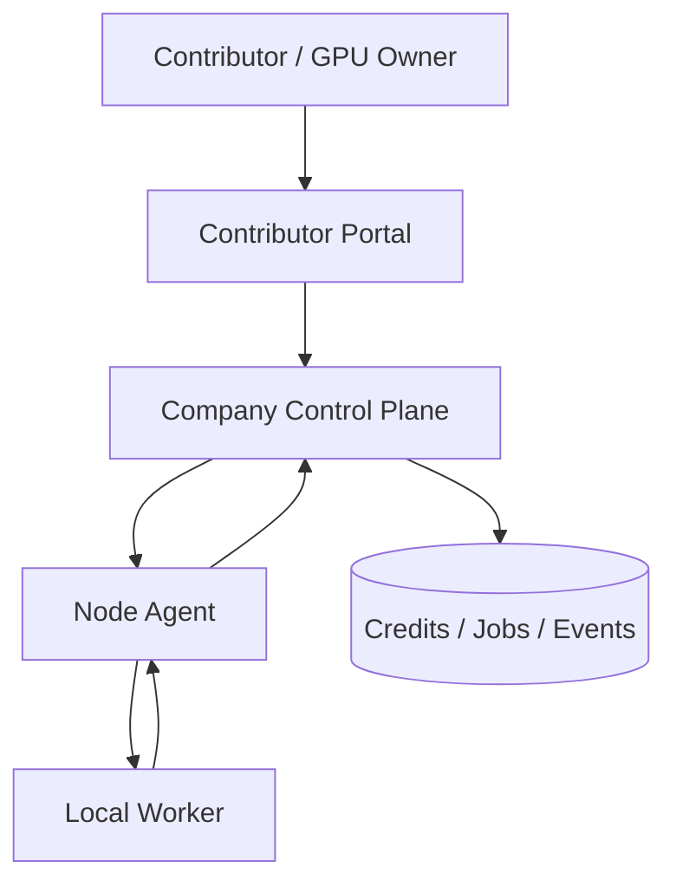

# Contributor Portal

This document describes the portal that a GPU owner or contributor uses to understand earnings, health, and work history.

The contributor portal is **not** the worker and it is **not** the public requestor API.
It is the owner-facing view for the machine that provides compute.

## What The Contributor Already Runs

On the contributor machine we already have:

- the node agent
- the local worker
- the local model cache
- the signed device identity

Those pieces let the control plane route jobs to the machine without exposing a public API from the contributor itself.

## What The Portal Is For

The contributor portal should show:

- current credits / earnings
- job history, with completed jobs opening a details view for the job payload, credits earned, duration, and worker/node used
- machine health
- current policy state
- contribution cap
- model state
- uptime / readiness
- pause / resume state
- settlement or payout history later

The portal gives the GPU owner one place to understand what the machine is doing and what it has earned.

## Local Preview

The dashboard app serves the contributor portal preview locally at:

- `http://127.0.0.1:<port>/portal`

It also mirrors the public-endpoint shape locally at:

- `http://127.0.0.1:<port>/public/portal`

## What The Portal Is Not

The contributor portal does **not**:

- expose the public requestor API
- replace the node agent
- replace the worker
- receive inbound job traffic directly from requestors
- own the company control plane

## Recommended Architecture

The portal should read from the company control plane or its durable database.

## Data Sources

The portal can show:

- `GET /v1/status`
- `GET /v1/nodes`
- `GET /v1/jobs`
- `GET /v1/job-events`
- `GET /v1/credits`

Those endpoints already exist in the current control plane prototype.

## Authentication

The portal should not rely on the contributor machine’s local worker identity alone.

Recommended split:

- device identity proves the machine is the same contributor node
- contributor account proves who should see credits and payout data
- operator token or session proves who is allowed to access the dashboard

For a local prototype, the portal can reuse the existing dashboard auth model.

## UX Principles

- keep the portal contributor-first, not operator-first
- make earnings visible immediately
- show whether the node is paused, policy-blocked, or healthy
- surface the signed device identity and trust path
- keep the controls simple: start, pause, cap, model, history

## Future Sections

- balances and withdrawals
- payout history
- tax / accounting exports
- multiple device management
- settlement status across operators
