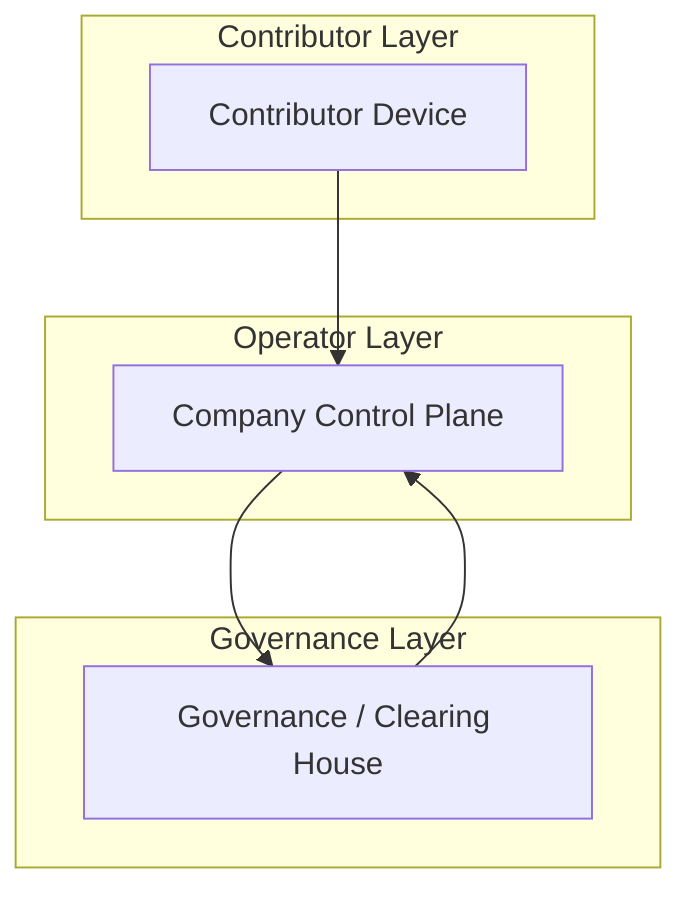
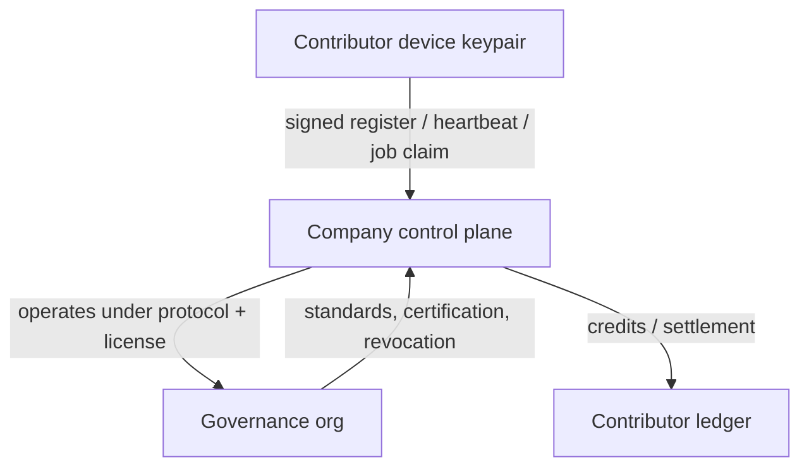

# Governance Model

This document describes the longer-term federated structure for OpenGPU:

- many operator companies can run their own control planes
- a top-level standards org defines the protocol, license rules, and settlement rules
- contributor devices keep their own local identity and continue to sign requests the same way

The current repo still implements a single-company prototype control plane, but the trust model below is the intended end state.

## High-Level Layers

## Responsibilities

### 1. Contributor devices

Contributor machines:

- run the CLI and node agent
- keep a non-exportable local device identity
- sign registration, heartbeat, and job lifecycle requests
- execute work locally when assigned
- keep local model cache and runtime state

Contributor devices do **not**:

- decide settlement rules
- manage global standards
- own customer relationships
- store company-wide policy or billing data

### 2. Company control planes

Operator companies:

- run their own control plane and dashboard
- onboard contributors
- schedule jobs
- enforce their own pricing and operational policy
- mirror durable events into their own database
- settle credits for the contributors they serve

Company control planes do **not**:

- redefine the network protocol on their own
- change the security model without governance agreement
- alter shared licensing terms

### 3. Governance / clearing house org

The top-level org:

- publishes the protocol and versioning rules
- defines license terms for the network
- certifies operator companies
- publishes minimum security requirements
- manages revocation / trust lists
- defines settlement and reconciliation rules
- keeps the standards small, explicit, and versioned

The governance org should **not**:

- run every job
- manage customer UX
- set company-specific pricing
- own contributor machines
- control local device keys

## Trust Flow

In practice:

- a device proves itself with its own signed identity
- a company proves compliance with the governance rules
- the governance org proves the network is interoperable and auditable

## Why This Separation Matters

- It lets multiple companies participate without breaking compatibility.
- It gives contributors a stable identity model even if they move between operators.
- It keeps the license / standards layer separate from customer operations.
- It allows clearing and settlement to be handled once, rather than reinvented by every operator.

## What To Review Later

- operator certification requirements
- governance membership rules
- revocation and dispute handling
- settlement file format
- protocol versioning and compatibility windows
- how a contributor can move between operator companies

