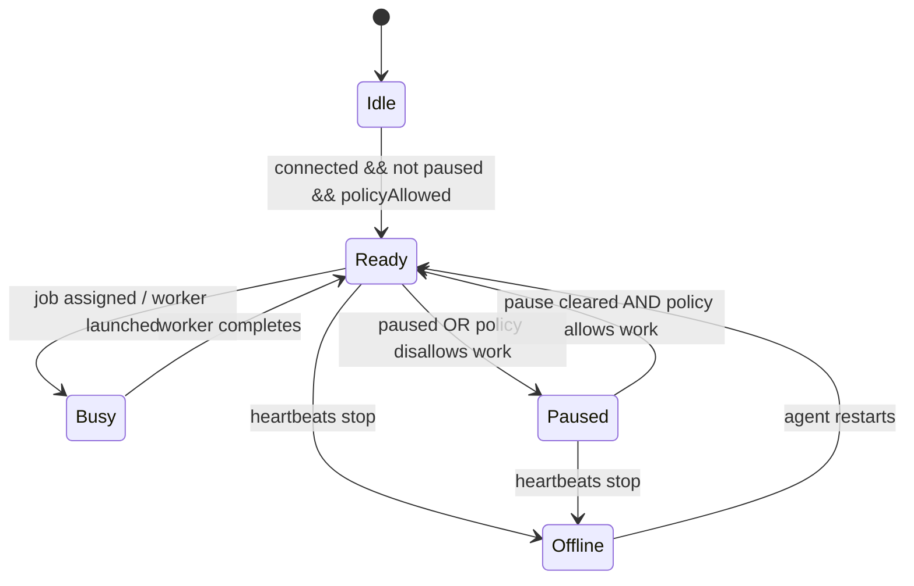

# Job Eligibility

This page explains when a contributor node is allowed to claim work and what happens after a job completes.

## Core Rule

A node should only claim a job when it is:

- connected
- not paused
- policy allowed
- worker healthy enough to run the requested backend
- capable of fitting the requested model or runtime requirements

If any of those checks fail, the node should skip the job and stay idle.

## Eligibility Signals

The current prototype already uses these signals:

- `connected`
- `paused`
- `policyAllowed`
- worker health snapshot
- backend match
- contribution cap
- power source and battery state

## State Model

## What "Idle" Means

Idle means:

- the node is installed
- the agent may still be running
- the worker is not actively computing
- the GPU stays cool until a job arrives

## What Happens After A Job Completes

Yes, the node returns to idle-ready behavior after completion:

1. The agent claims the job.
2. The worker launches locally.
3. The worker finishes the task.
4. The agent sends the completion payload upstream.
5. The control plane marks the job completed or failed.
6. The node returns to `ready` if it is still connected and policy allowed.

That means the worker exits and the machine becomes available for the next job without staying hot in the meantime.

## What Happens If The Node Cannot Run The Job

If the node is too small, busy, paused, missing the model, or otherwise not allowed to work:

- it does not claim the job
- the job remains queued
- another eligible node can claim it later

## Why This Matters

This is what makes the contributor experience friendly:

- no forced compute when there is no job
- no claiming jobs the node cannot actually complete
- no need to keep the GPU hot all the time

## Related Docs

- [System Flow](/Users/DBATALL/Documents/mundusx/docs/system-flow.md)
- [Agent / Worker Contract](/Users/DBATALL/Documents/mundusx/docs/agent-worker-contract.md)
- [Node Agent](/Users/DBATALL/Documents/mundusx/docs/node-agent.md)
- [Who Runs What](/Users/DBATALL/Documents/mundusx/docs/who-runs-what.md)
