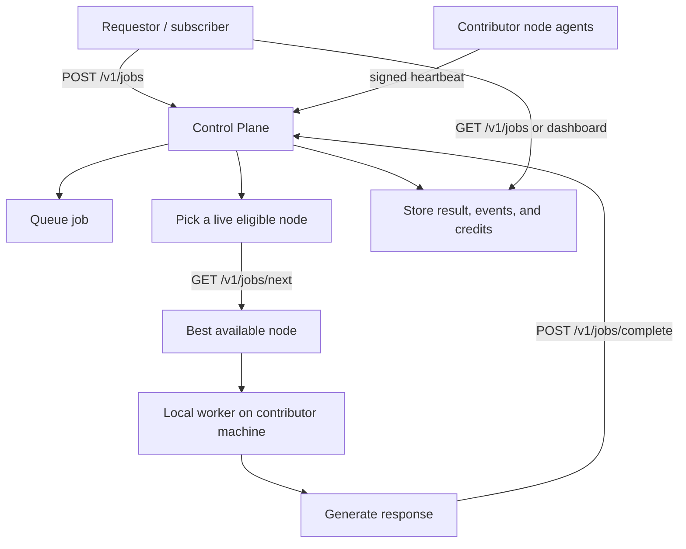

# Requestor Flow

This page describes how a subscriber, SDK, dashboard, or other requestor gets a response from NovusX.

For the requestor-facing compatibility endpoint itself, see [docs/requestor-api.md](/Users/DBATALL/Documents/mundusx/docs/requestor-api.md).

## The Short Version

Yes, the system should route work to whichever contributor node is capable and available.

If a contributor machine is too small, busy, policy-blocked, missing the model, or otherwise not ready, the control plane should not send that job there. The request stays queued until a better node can claim it.

## End-To-End Flow

## What The Requestor Does

1. A client, SDK, or dashboard sends `POST /v1/jobs` to the control plane.
2. If operator auth is enabled, the control plane checks the operator bearer token first.
3. The job is stored as `queued`.
4. The requestor waits for the job to be claimed and completed.
5. The result is read back from the control plane or dashboard.

## What The Contributor Does

1. Each contributor machine sends signed heartbeats.
2. The control plane tracks:
   - agent state
   - policy state
   - backend
   - available memory
   - worker health
3. When a queued job exists, the node agent asks `GET /v1/jobs/next?node_id=...`.
4. The control plane chooses a node only if it is live, eligible, and compatible with the job.
5. The node launches its local worker and returns the result.

## When A Node Is Too Small Or Busy

The node should simply be skipped.

The control plane uses live node data such as:
- `policyAllowed`
- agent state
- worker health
- backend
- available memory
- available GPU percent
- contribution cap / power state

If a node cannot handle the job, the job stays queued until another node can take it.

## What Is Already In Code

The current prototype already has:
- `POST /v1/jobs`
- `POST /v1/chat/completions`
- `GET /v1/jobs`
- `GET /v1/jobs/next?node_id=...`
- `POST /v1/jobs/complete`
- signed device requests for contributor routes
- a local worker path on the contributor machine
- job events and credits tracking

## What Is Still Missing

- a dedicated subscriber/requestor app or SDK
- richer multi-node scheduling and fairness rules
- a public-facing requestor UI

## How To Update

- If request submission changes, update the `POST /v1/jobs` section.
- If node selection changes, update the contributor and eligibility sections.
- If we add a subscriber UI, link it here as the primary requestor entrypoint.
