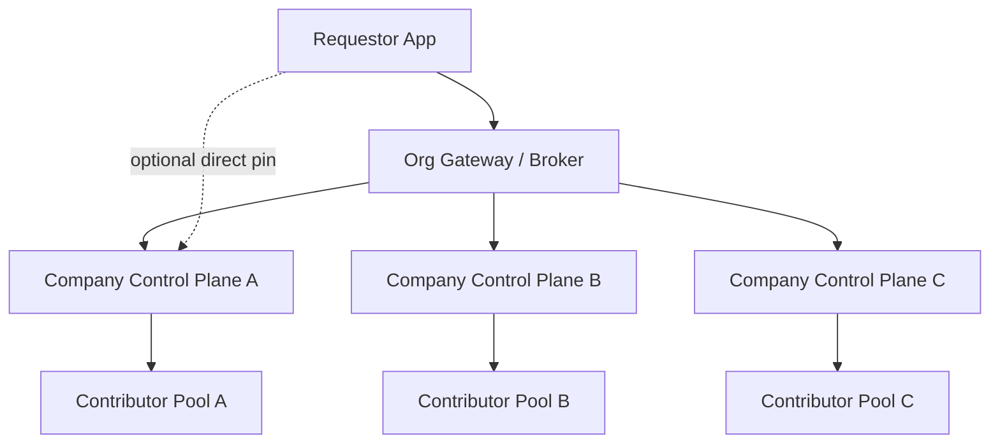

# Requestor Routing

This document explains how requestors should reach OpenGPU when the network grows beyond a single operator.

## Default Path

The recommended default is:

1. A requestor app talks to an org-managed gateway or broker.
2. The gateway chooses a certified company control plane.
3. The company control plane routes the job to one of its contributor nodes.
4. The result returns back through the same path.

This gives requestors one stable OpenAI-style API while still allowing many operator companies underneath.

## Direct Provider Path

An app creator can also pin directly to a specific control plane when they explicitly want to do that.

That path is useful for:

- lower latency
- private deployments
- special pricing
- custom policy
- testing and staging

Direct routing should be treated as an explicit choice, not the default.

## Warning Model

If a requestor bypasses the gateway and connects directly to one company control plane, the UI should make that visible.

Recommended warning signals:

- provider name
- certification status
- region
- failover disabled or limited
- policy differences
- billing / trust implications

The app should make it obvious that the requestor has chosen a specific provider.

## Routing Layers

There are two separate routing decisions:

- the gateway routes across companies
- each company control plane routes within its own contributor pool

## Why This Is the Preferred Shape

- requestors keep one stable API
- companies still compete and differentiate underneath the gateway
- contributors stay private behind operator control planes
- failover can happen without exposing individual contributor nodes
- credits, policy, and settlement stay reviewable

## What To Keep in Mind

- If the gateway is unavailable, the system needs a fallback policy.
- If a requestor pins directly to one provider, they may lose automatic failover.
- The direct path should be clearly labeled as an advanced or expert mode.

## Current Repo Status

The current codebase is still a local single-control-plane prototype.
This routing document describes the intended federated end state, not a completed multi-provider deployment.
