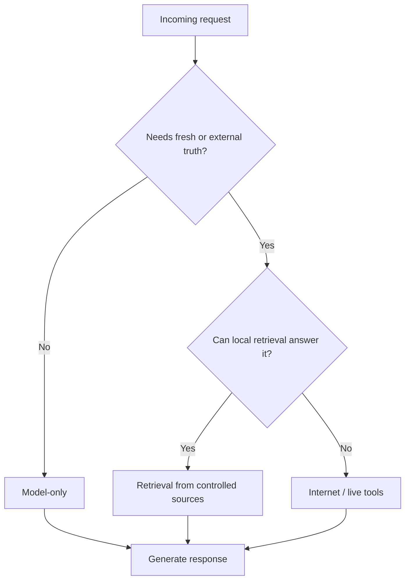

# Retrieval Policy

This page explains when a request should be answered by the model alone, when retrieval should be used, and when the request should reach an internet-backed tool layer.

## Short Answer

- **Model-only** for ordinary reasoning, drafting, and general knowledge that the model already knows well enough.
- **Retrieval** when the answer should be grounded in local documents, project data, or a controlled knowledge source.
- **Internet / live tools** when the answer depends on fresh facts, current events, or external sources that are not already in the local knowledge base.

The GPU itself does not decide this. The requestor layer, gateway, or control plane policy decides which mode to use.

## Why This Matters

The worker only runs the model. It does not automatically browse the internet.

That keeps the compute layer simple:

- prompt in
- generation out
- no hidden browsing behavior

If the product needs live context, the layer above the worker must fetch it intentionally.

## Mode 1: Model-Only

Use model-only mode when:

- the user wants a normal chat answer
- the prompt is about reasoning, summarizing, rewriting, or brainstorming
- no external source of truth is required

Examples:

- “Summarize this paragraph.”
- “Draft a friendly reply.”
- “Explain how a state machine works.”

## Mode 2: Retrieval

Use retrieval when the answer should be grounded in controlled content that the model should not guess from memory.

Examples:

- repository docs
- product manuals
- contributor portal records
- job history
- credits ledger
- internal company knowledge base

Retrieval usually means:

1. search a document store or index
2. collect the most relevant passages
3. pass that context into the model

## Mode 3: Internet / Live Tools

Use live tools when the answer depends on current or external facts.

Examples:

- recent news
- current prices
- public web pages
- live company status pages
- up-to-date APIs

This should be explicit. Do not silently browse unless the product policy says to do so.

## Suggested Decision Flow

## Product Policy Notes

- Requestor apps may choose the mode.
- The org gateway may enforce or recommend the mode.
- Company control planes may expose a policy header or parameter to request retrieval.
- Contributors do not need to know the mode unless the job itself depends on extra context.

## Current Prototype Status

The current `/v1/chat/completions` path is a queued compatibility layer.
It does not browse the internet by itself.

If the product later adds retrieval or browsing, that should happen in a dedicated policy layer above the worker.

## Related Docs

- [Requestor API](/Users/DBATALL/Documents/aigrid/docs/requestor-api.md)
- [Requestor Flow](/Users/DBATALL/Documents/aigrid/docs/requestor-flow.md)
- [System Flow](/Users/DBATALL/Documents/aigrid/docs/system-flow.md)
