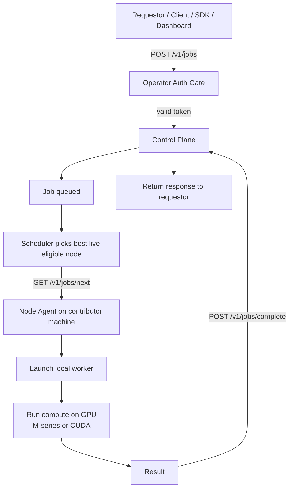
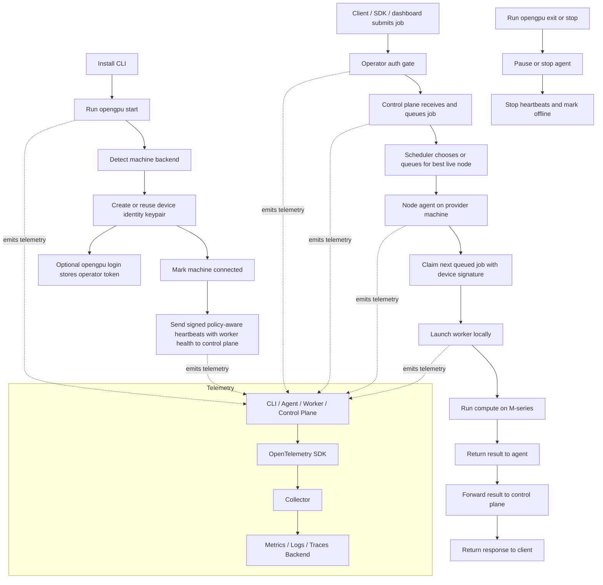

# NovusX System Flow

This page is the living end-to-end one-pager for how NovusX works.

## Requestor → Control Plane → GPU

## What It Means

- `CLI` is the user-facing entry point.
- `Agent` is the background service on the provider machine.
- `Worker` is the short-lived local compute process.
- `Control Plane` chooses where work goes and keeps the live registry.
- `Control Plane` queues jobs, lets agents claim them, and keeps the live registry.
- `Control Plane` also records the node power/policy fields from heartbeats so the dashboard can show why a Mac is paused.
- `Control Plane` also records the worker health snapshot from heartbeats so the dashboard can show backend readiness before it assigns work.
- `Operator auth` protects the human-facing control-plane routes when `OPENGPU_OPERATOR_TOKEN` is configured.
- `Device signatures` protect contributor-machine routes (`register`, `heartbeat`, `jobs/next`, and `jobs/complete`).
- The browser page at `/` shows per-node rows with backend, state, power, battery, policy, and policy reason.
- `Telemetry` is emitted by every layer and shipped separately from the job path.

## Auth And Trust Model

### New contributor machine

1. `opengpu start` or `opengpu connect` auto-inits on first use.
2. The CLI reuses an existing device keypair, or generates one once if none exists.
3. The node agent sends a signed `register` request that includes:
   - node ID
   - hostname
   - public key fingerprint
   - public key
   - backend
   - contribution percent
4. The control plane verifies the signature with the public key in that payload and stores the node record.
5. After that, the same device keypair signs heartbeat and job-claim/completion requests.

### Contributor requests

- `register`, `heartbeat`, `jobs/next`, and `jobs/complete` are device-authenticated with Ed25519 signatures.
- The `hostname` is part of the signed contributor identity, so the operator can audit which physical machine is connected.
- The `worker health snapshot` travels with the signed heartbeat, so the control plane and dashboard can show whether the local runtime is actually ready.

### Operator requests

- Human-facing control-plane routes use a bearer token when `OPENGPU_OPERATOR_TOKEN` is set.
- The CLI stores that token locally with `opengpu login` and clears it with `opengpu logout`.
- If the token is not configured on the control plane, the prototype keeps those routes open for local development.

## How The Control Plane Checks Requests

### Job submission

1. A client, SDK, or dashboard sends `POST /v1/jobs`.
2. If `OPENGPU_OPERATOR_TOKEN` is configured, the control plane checks the bearer token first.
3. If the token is valid, the control plane stores the job as `queued`.
4. The job remains queued until a compatible live node claims it.
5. The queued job keeps its execution profile too:
   - prompt
   - optional system prompt
   - optional max tokens
   - optional temperature
   - optional top-p
   - optional seed

### Job claim

1. A node agent sends `GET /v1/jobs/next?node_id=...`.
2. The control plane checks the device signature on the request.
3. The control plane loads the node record and makes sure:
   - the node exists
   - the node is ready or busy
   - policy allows it to work
4. The control plane scans queued jobs and picks the first one whose preferred backend matches the node backend, or is `auto`.
5. The control plane marks the job as `assigned` and marks the node as `busy`.
6. The worker finishes and the node returns to `ready` if it is still connected and policy allowed, which means the GPU goes back to idle until the next assignment.

### Job completion

1. The node agent sends `POST /v1/jobs/complete`.
2. The control plane checks the device signature again.
3. The control plane confirms the job was actually assigned to that node.
4. If the job matches, it is stored as `completed` or `failed`.
5. The node is returned to `ready` if it was busy, which means the worker exits and the machine becomes idle again.

## Provider Machine Layout

On a provider machine, the installed pieces should be:

- `opengpu` CLI for setup, control, and visibility
- node agent for policy-aware heartbeat, policy, and job launch
- worker/runtime for the actual `M` execution path

The worker does **not** need to sit there idle all the time. It should be started on demand when work arrives, then stopped or reused according to policy.

### Install List

For a provider machine, the user should install:

1. `opengpu` CLI
2. node agent service
3. backend runtime support for the machine:
   - `llama.cpp` with `BLAS` / `Accelerate` on Mac
4. optional monitoring / telemetry exporter if we bundle it locally later

The contribution percent is a **cap**, not full ownership of the machine:

- `20%` means light background contribution
- `50%` means balanced contribution
- `90%` means near-max contribution, still bounded by safety policy

The agent should still enforce:

- thermals
- battery / power state on laptops
- foreground activity
- memory pressure
- pause / exit commands
- policy-aware heartbeats so the control plane sees the node as paused when it should not take work

## How To Update It

- If the install flow changes, update the top-left branch.
- If the scheduling model changes, update the control-plane and scheduler branch.
- If the provider lifecycle changes, update the heartbeat and stop branches.
- If telemetry changes, keep the subgraph in sync with the actual SDK/export path.
