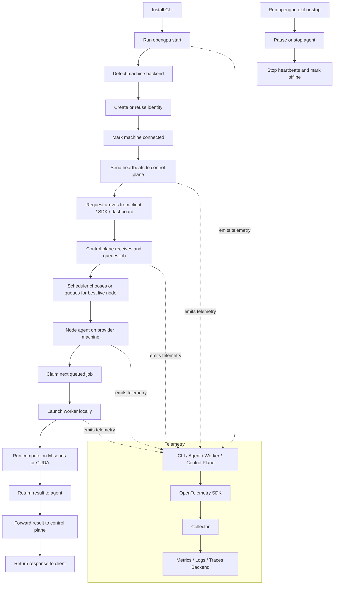

# OpenGPU System Flow

This page is the living end-to-end diagram for how OpenGPU should work.

## What It Means

- `CLI` is the user-facing entry point.
- `Agent` is the background service on the provider machine.
- `Worker` is the short-lived local compute process.
- `Control Plane` chooses where work goes and keeps the live registry.
- `Control Plane` queues jobs, lets agents claim them, and keeps the live registry.
- `Telemetry` is emitted by every layer and shipped separately from the job path.

## Provider Machine Layout

On a provider machine, the installed pieces should be:

- `opengpu` CLI for setup, control, and visibility
- node agent for heartbeat, policy, and job launch
- worker/runtime for the actual `M` or `CUDA` execution path

The worker does **not** need to sit there idle all the time. It should be started on demand when work arrives, then stopped or reused according to policy.

### Install List

For a provider machine, the user should install:

1. `opengpu` CLI
2. node agent service
3. backend runtime support for the machine:
   - `Metal` for `M` series
   - `CUDA` for NVIDIA
4. optional monitoring / telemetry exporter if we bundle it locally later

The contribution percent is a **cap**, not full ownership of the machine:

- `20%` means light background contribution
- `50%` means balanced contribution
- `90%` means near-max contribution, still bounded by safety policy

The agent should still enforce:

- thermals
- battery / power state on laptops
- foreground activity
- memory pressure
- pause / exit commands

## How To Update It

- If the install flow changes, update the top-left branch.
- If the scheduling model changes, update the control-plane and scheduler branch.
- If the provider lifecycle changes, update the heartbeat and stop branches.
- If telemetry changes, keep the subgraph in sync with the actual SDK/export path.
